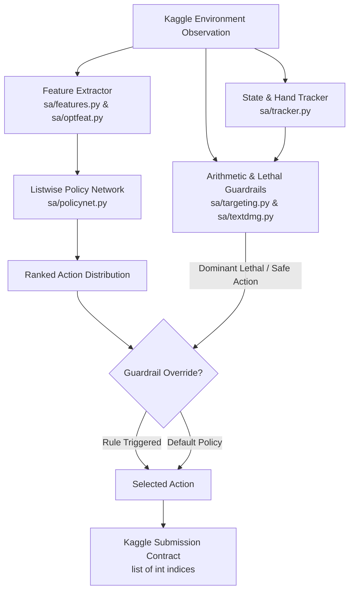

# Pokémon TCG AI Agent — Team Scio

A high-performance, hypothesis-driven AI agent developed for the [Kaggle Pokémon TCG AI Battle Challenge](https://www.kaggle.com/competitions/pokemon-tcg-ai-battle).

Built for the dual-track challenge: competing on the **Simulation Leaderboard** (Peak Rank 129 of 6,483, Score 990.7) and structured for the **Strategy Category Championship** (70% Model Score, 20% Deck Score, 10% Report).

---

## 📖 Table of Contents

- [Overview: What It Does](#-overview-what-it-does)
- [Motivation: Why It Was Built](#-motivation-why-it-was-built)
- [Architecture: How It Works](#-architecture-how-it-works)
  - [1. Policy Network (Fast Neural Prior)](#1-policy-network-fast-neural-prior)
  - [2. Arithmetic & Lethal Guardrails](#2-arithmetic--lethal-guardrails)
  - [3. State Tracking & Imperfect Information](#3-state-tracking--imperfect-information)
  - [4. Value Lookahead & Counterfactual Analysis](#4-value-lookahead--counterfactual-analysis)
  - [5. Time & Budget Allocation](#5-time--budget-allocation)
- [Repository Structure](#-repository-structure)
- [Documentation & Research Log](#-documentation--research-log)
- [Getting Started](#-getting-started)
  - [Prerequisites & Installation](#prerequisites--installation)
  - [Running the Arena](#running-the-arena)
  - [Training Policy Networks](#training-policy-networks)
  - [Building a Kaggle Submission](#building-a-kaggle-submission)
- [Key Empirical Findings](#-key-empirical-findings)
- [License & Acknowledgments](#-license--acknowledgments)

---

## 🎯 Overview: What It Does

This repository contains the complete codebase, evaluation engine, dataset pipeline, and research dossier for an autonomous Pokémon Trading Card Game (PTCG) battle agent:

- **Ultra-Fast Sub-Millisecond Decisions**: Executes inference in ~1 ms per move, consuming less than 0.1 seconds of the 600-second cumulative game time budget.
- **Listwise Action Ranking**: Neural policy network scores and ranks dynamic, variable-length option lists (attacks, trainer cards, abilities, bench placements, energy attachments, retreat targets).
- **Exact Arithmetic Guardrails**: Deterministic domain rules override neural outputs when a provably optimal or dominated action is available (e.g., active lethal KO calculations, bench snipe kills, avoiding self-inflicted attack locks).
- **Imperfect Information Tracking**: Real-time state tracker maintains opponent hand contents, public discards, prize card counts, and deck resource distributions.
- **High-Throughput Paired Arena**: Built-in multi-process simulation environment supporting statistical A/B testing with Wilson 95% confidence intervals and automated Elo rating estimation.

---

## 💡 Motivation: Why It Was Built

The Kaggle Pokémon TCG AI Battle Challenge presents unique theoretical and engineering hurdles:

### 1. The Game Constraints
- **Combinatorial Action Chains**: Unlike turn-based board games with discrete single moves, a single PTCG turn involves arbitrary sequences of item searches, bench switches, ability triggers, energy attachments, and attacks.
- **Hidden & Stochastic State**: Hands are concealed, prize cards are face-down, and card draws depend on randomized deck ordering.
- **Strict Compute Limits**: Kaggle environments enforce a 2-vCPU limit, no GPU acceleration during inference, and a strict 600-second cumulative clock per game across hundreds of micro-decisions.

### 2. The Dual-Track Rubric
The competition evaluates agents along two parallel tracks:
- **Simulation Category**: Pure win-rate and Elo rating on the live leaderboard.
- **Strategy Category**: A holistic evaluation of the agent's strategic design, hypothesis-driven experimentation, deck synergy, and empirical rigor (70% Model Score, 20% Deck Score, 10% Report).

### 3. Empirical Discipline Over Speculation
Early exploratory results showed standard approaches fail under these constraints:
- **MCTS Rollout Noise**: Unconstrained tree search agents scored 0.323 against cloned policies because random rollouts over high-variance stochastic card games produce noisy terminal credit assignment ($SE \approx 0.14$).
- **Naive Imitation Scaling**: Simply scaling up uncurated human replay data decreased performance ($0.72 \to 0.44$ win-rate) due to skill dilution from weaker demonstrators.
- **The Scio Solution**: A tightly integrated hybrid architecture—combining a listwise behavioral cloning neural prior trained strictly on top-tier demonstrator games with deterministic micro-tactics and rigorous pre-registered hypothesis testing.

---

## ⚙️ Architecture: How It Works



### 1. Policy Network (Fast Neural Prior)
- **Module**: `agents/sa/policynet.py`, `agents/sa/features.py`, `agents/sa/optfeat.py`
- **Input Encoding**:
  - **Dense State**: Board status, active Pokémon HP, energy counts, bench slot occupancy, prize differentials.
  - **Entity Embeddings**: Card IDs, attack IDs, and target slot mappings ($d=16$).
  - **Bag-of-Words Context**: Mean-pooled embeddings for player hand, player discard, and opponent discard.
- **Scoring Function**: Joint MLP evaluating `[state_repr, option_repr]` to assign a listwise softmax logit to every legal option.

### 2. Arithmetic & Lethal Guardrails
- **Module**: `agents/sa/targeting.py`, `agents/sa/textdmg.py`
- Overrides the neural policy on provably dominated micro-decisions:
  - **Lethal Routing**: Directly calculates damage modifiers (weakness, resistance, tool buffs) to execute lethal knockouts immediately.
  - **Bench Snipe Optimization**: Prioritizes key low-HP benched threats when multi-target damage is available.
  - **Anti-Self-Locking**: Prevents playing setup cards that trap an ineffective active attacker.

### 3. State Tracking & Imperfect Information
- **Module**: `agents/sa/tracker.py`
- Maintains public state memory:
  - Cards revealed in opponent hand via search effects or Professor's Research / Iono.
  - Resource depletion in opponent discard pile (e.g., remaining Energy or Boss's Orders).
  - Accurate prize counts and knockout race tracking.

### 4. Value Lookahead & Counterfactual Analysis
- **Module**: `agents/sa/valuenet.py`, `agents/sa/vlook.py`, `agents/sa/oracle.py`
- Evaluates transition states, opponent counter-responses, and expected prize trades.
- Provides counterfactual move value estimation for strategic positioning.

### 5. Time & Budget Allocation
- **Module**: `agents/sa/timemgr.py`, `agents/sa/bcagent.py`
- Manages clock expenditure between major decision points (e.g., MAIN turn phase selection) vs trivial single-choice selects.
- Embedded telemetry (`STATS`) monitors health, catch-all fallback executions, and decision latencies.

---

## 📁 Repository Structure

```
pokemon-tcg-agent/
├── README.md               # Main repository documentation (this file)
├── docs/                   # Full research dossier & competition documentation
│   ├── STRATEGY.md         # Strategy Category flagship submission report
│   ├── EVIDENCE.md         # Living hypothesis & experimental measurement log
│   ├── ROADMAP.md          # Architectural milestones and engineering charter
│   ├── HANDOFF.md          # Live operational log, standing, and daily journal
│   ├── competition_details_and_rubric.md # Competition rubric & guidelines
│   └── experiments/        # Individual experiment reports (E1 to E34)
├── agents/                 # Agent implementations & weights
│   ├── sa/                 # Main Scio agent (policy net, features, guardrails)
│   │   ├── agent.py        # Search / Hybrid agent interface
│   │   ├── bcagent.py      # Behavioral clone policy agent & telemetry
│   │   ├── policynet.py    # Policy neural network forward pass
│   │   ├── targeting.py    # Arithmetic lethal and targeting logic
│   │   ├── tracker.py      # Opponent hand and state tracker
│   │   └── policy_net.npz  # Exported policy weights
│   └── agentkit/           # Baseline and reference bot implementations
│       └── rulebased/      # Rule-based bots (v10, Lucario, Dragapult, etc.)
├── decks/                  # 60-card competition deck definitions
│   ├── grimmsnarl.py       # Primary Grimmsnarl / Froslass control list
│   ├── teal_mask_ogerpon.py# Teal Mask Ogerpon archetype
│   ├── mega_lucario_ex.py  # Lucario archetype
│   └── ...                 # Additional meta deck profiles
├── scripts/                # Training, evaluation, and packaging pipelines
│   ├── arena.py            # High-throughput paired-match local arena
│   ├── train_policy.py     # Policy network training pipeline
│   ├── build_submission.py # Kaggle tar.gz packaging & Python 3.11 validator
│   ├── build_policy_dataset.py # Replay feature extractor
│   └── p9_field_census.py  # Meta census and anchor evaluation
├── src/                    # Shared PTCG environment and SDK interfaces
│   └── ptcg/
│       ├── config.py       # Global environment configurations
│       └── env/            # Harness and local battle simulation hooks
├── notebooks/              # Analysis and visualization notebooks
└── papers/                 # Reference literature on TCG AI and card games
```

---

## 📚 Documentation & Research Log

All strategic analysis, empirical data, and development logs are organized within the `docs/` directory:

- [**`docs/STRATEGY.md`**](docs/STRATEGY.md): The primary submission dossier for the Strategy Category. Contains technical rationale, mathematical formulations, deck construction strategies, and prize-mapping theory.
- [**`docs/EVIDENCE.md`**](docs/EVIDENCE.md): The empirical hypothesis log recording over 50 pre-registered experiments with exact confidence intervals, sample sizes ($n \ge 1,000$), and causal post-mortems.
- [**`docs/ROADMAP.md`**](docs/ROADMAP.md): Strategic roadmap tracking research hypotheses, compute allocations, and rubric alignment.
- [**`docs/HANDOFF.md`**](docs/HANDOFF.md): Engineering handoff log capturing daily execution notes, leaderboard drift, and deployment history.
- [**`docs/competition_details_and_rubric.md`**](docs/competition_details_and_rubric.md): Formal competition guidelines and rubric breakdown.
- [**`docs/experiments/`**](docs/experiments/): Detailed standalone experiment logs (E1 through E34).

---

## 🚀 Getting Started

### Prerequisites & Installation

1. **Clone the repository**:
   ```bash
   git clone https://github.com/SiamRahman29/pokemon-tcg-agent.git
   cd pokemon-tcg-agent
   ```

2. **Environment Setup**:
   Python 3.10+ is supported locally; Python 3.11 is used for Kaggle submission validation:
   ```bash
   # Using uv (recommended)
   uv venv --python 3.11
   source .venv/bin/activate

   # Or standard venv
   python3 -m venv .venv
   source .venv/bin/activate
   pip install torch numpy scipy
   ```

### Running the Arena

The local arena executes paired, seat-swapped matches to test agent versions:

```bash
# Run 100 matches between the behavioral clone and a rule-based baseline
python scripts/arena.py play bc rule:v10,noS --matches 100 --deck-a grimmsnarl --deck-b lucario_v10

# Calculate current Elo ratings across all archived matches in out/arena/games.jsonl
python scripts/arena.py elo
```

### Training Policy Networks

Train the listwise behavioral cloning policy on extracted replay datasets:

```bash
# Train policy with listwise softmax loss and streaming loader
python scripts/train_policy.py \
    --ds artifacts/pds \
    --out agents/sa/policy_net.npz \
    --loss listwise \
    --stream \
    --epochs 10
```

### Building a Kaggle Submission

Package the agent into a compliant `.tar.gz` bundle, verifying Python 3.11 compatibility and running an end-to-end self-play smoke test:

```bash
python scripts/build_submission.py --deck grimmsnarl --agent bc
```

Artifacts are verified against size limits (< 197.7 MiB) and exported to `dist/submission.tar.gz`.

---

## 🔬 Key Empirical Findings

| Hypothesis / Area | Intervention | Result | Insight |
|---|---|---|---|
| **Tree Search (MCTS)** | Wall-clock MCTS vs Fast Policy | ❌ Lost (0.323 win-rate) | Search rollouts suffer severe credit assignment variance in stochastic card games under low-compute budgets. |
| **Unfiltered Data Volume** | 160× increase in uncurated replay rows | ❌ Win-rate fell to 0.440 | Training accuracy rose while gameplay win-rate dropped due to imitating sub-optimal players. Quality > Quantity. |
| **Top-Tier Filtering** | Mined top-N% demonstrator games ($Elo \ge 1120$) | ✅ +115 Elo gain | Selective cloning anchors the neural prior to elite decision spaces. |
| **Arithmetic Guardrails** | Deterministic Lethal KO & Bench Targeting | ✅ +0.104 win-rate recovery | Hard mathematical rules eliminate blind spots in neural softmax tails. |
| **Supporter Sequencing** | Discard & Draw Ordering Rules | ✅ Statistically significant | Enforcing legal setup ordering prevents self-inflicted turn stalls. |

---

## 📄 License & Acknowledgments

- Built by **Team Scio** for the Kaggle Pokémon TCG AI Battle Challenge.
- All game rules and trademarks are property of Nintendo, Creatures Inc., and GAME FREAK Inc.
